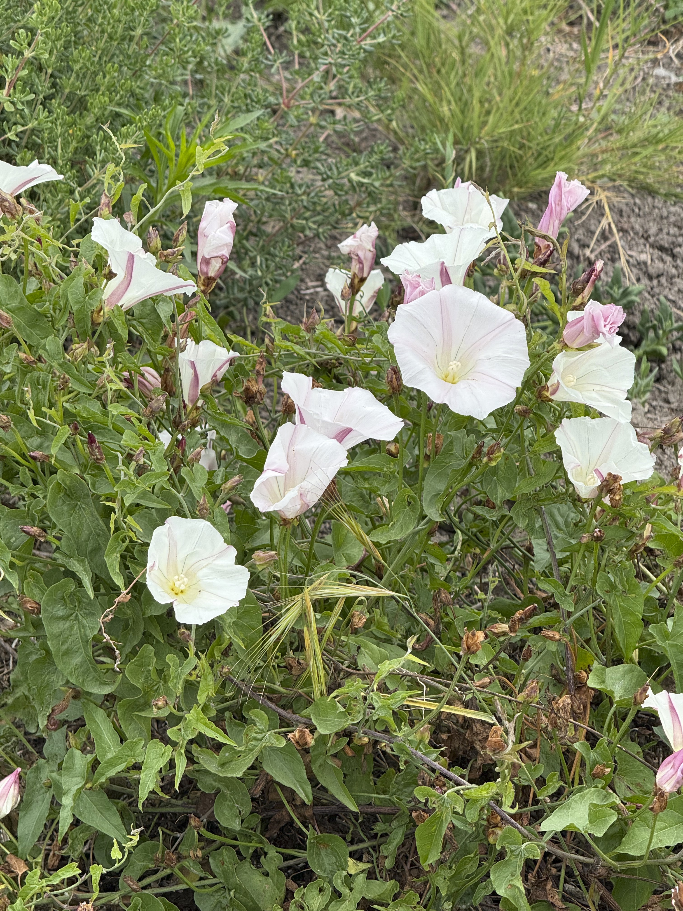
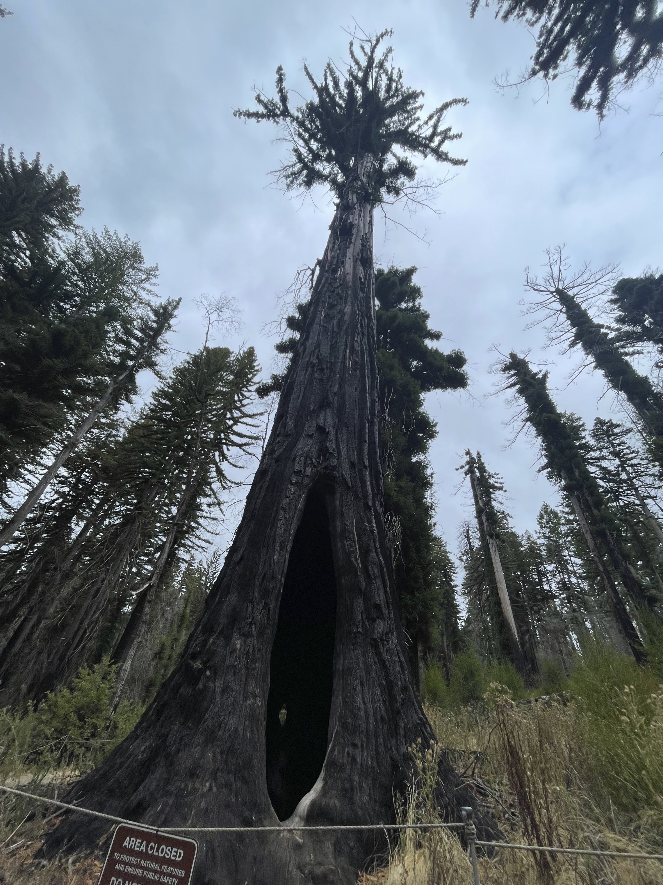

## Travels

In my life, I've had the privilege of being able to travel to different places and see different parts of the country. Below is an interactive map of my travel destinations! Feel free to toggle on and off the code chunks.

```{r}
#| label: Set Up
#| message: false
#| echo: true
#| code-fold: true
# adding necessary packages
library(tidyverse) 
library(plotly) 
library(DT)
library(leaflet) 
map <- read.csv("travel_data.csv")
saveRDS(map, file = "output_file..rds")
mapRDS <- readRDS("output_file..rds")
```

```{r}
#| echo: true
#| code-fold: true
site_map <- leaflet() |> 
  addProviderTiles(providers$Esri.WorldImagery, group = "ESRI World Imagery") |> 
  addProviderTiles(providers$Esri.OceanBasemap, group = "ESRI Oceans") |> 
setView(lng =  -100, lat = 40, zoom = 2) |> 
   addMiniMap(toggleDisplay = TRUE, minimized = TRUE) |> 
  addMarkers(data = mapRDS, group = "Sites",
             lng = ~Long, lat = ~Lat,
             popup = paste("State:", mapRDS$Site, "<br>", 
                           "Coordinates (lat/long):", mapRDS$Lat.long)) |> 
  addLayersControl(
    baseGroups = c("ESRA World Imagery", "ESRI Oceans"), 
    overlayGroups = c("Sites")
  )
  
site_map
```

## Tidepools

In my free time, I enjoy going to the tidepools during low tide and seeing what I can find there.

## Plants

I also enjoy seeing different kinds of plants. Some of my favorites include redwood trees, California morning glories, and poppies. 

<div style="display: grid; grid-template-columns: repeat(3, minmax(0, 1fr)); gap: 8px; width: 100%;">

  
  
  

  
  
  

</div>
