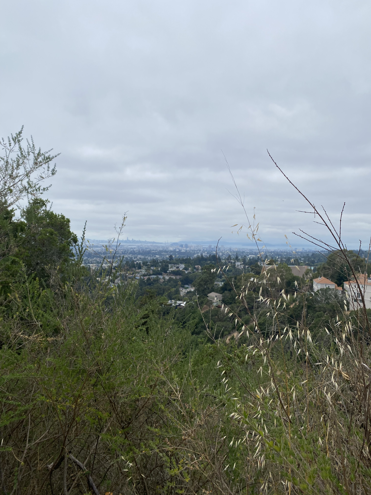
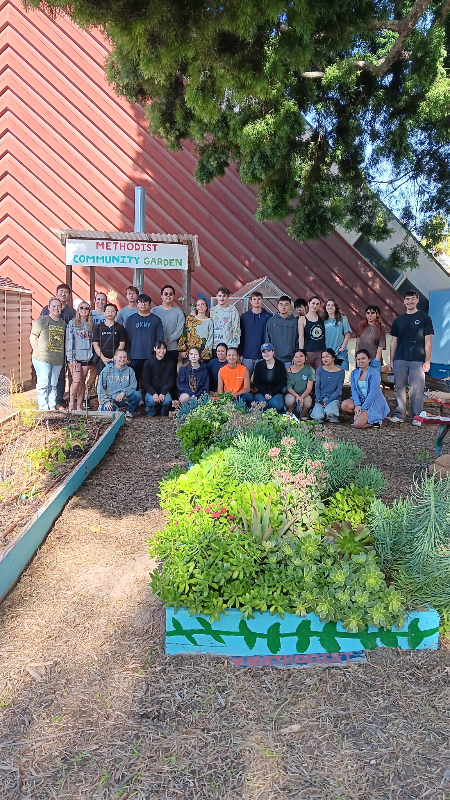

## Hometown

I was raised in Oakland, CA, which is in the Bay Area, right across the bay from San Francisco. I take a lot of pride in being from Oakland as it has truly shaped the person I've become. I grew up exploring the bay and California in general and fell in love with the area. 

## Career Goals

After my time ends at UCSB, I would like to enter the sphere of research. Ideally, I would like to become a PhD student studying wildfire and its ecological impacts. After taking a fire ecology class and beginning my work at the LEAF Lab, I have realized that is a significant interest of mine that I would like to pursue as a career. 

## Community Involvement

Throughout my life, I've had many opportunities to engage with people in my community. In Oakland, I volunteered at the food bank and worked the election. Additionally, my roles with the Edible Campus Program have allowed me to be come particularly active in my community. In these roles, I've been able to engage the congregation at University United Methodist Church of Isla Vista and engage other community members in sustainable agriculture initiatives. In this role, I have also been able to take part in other initiatives, such as Showers of Blessings. 
